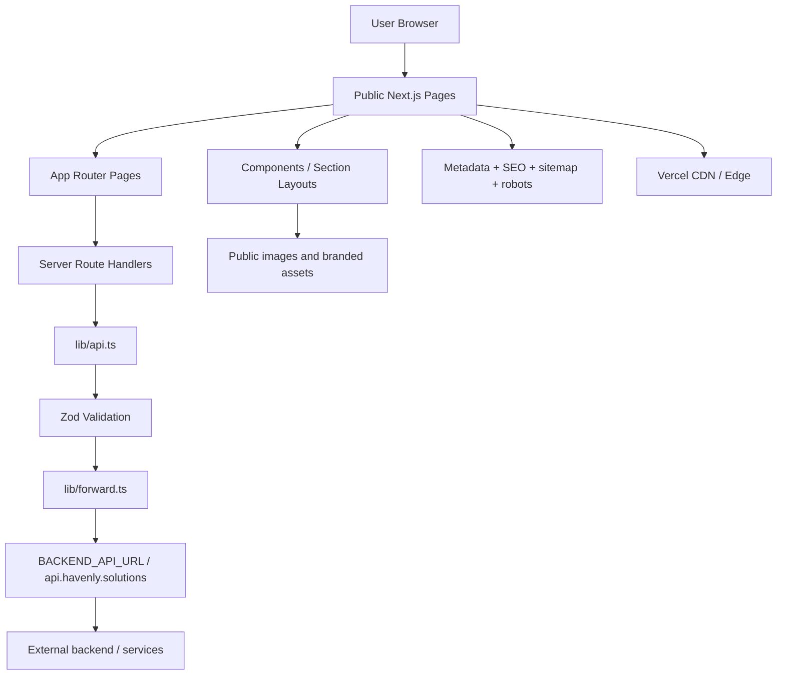

# Havenly Solutions Architecture

## Status
VERIFIED: This document reflects the repository as it exists in the working tree and the production build that was validated with npm run build.

## High-level overview
Havenly Solutions is a public-facing Next.js marketing and lead-generation site for a civic technology platform. It uses the App Router, static pages for public content, and server route handlers for form submissions. The app does not include a custom backend service in this repository; backend delivery is handled by external public endpoints referenced through environment variables.

## Frontend layers
- App Router under app/
- Shared UI under components/
- Reusable data and config under lib/
- Public assets under public/images/
- Global CSS under app/globals.css
- Metadata and SEO configuration in app/layout.tsx, app/sitemap.ts, app/robots.ts, lib/site.ts

## Backend boundary
The backend is external. There is no application server or database source in this repository. The confirmed boundary is:
- Frontend: this Next.js project
- Backend: environment-defined API base URL, currently defaulting to https://api.havenly.solutions
- Delivery behavior: FORM submissions are proxied through route handlers and forwarded by lib/forward.ts

## API layer
The public API surface currently verified in code is:
- POST /api/pre-register
- POST /api/partner-enquiry
- POST /api/contact
- POST /api/unsubscribe
- GET /view-in-browser
- GET /robots.txt
- GET /sitemap.xml

The route handlers use NextRequest, validate input with Zod, enforce origin checks, rate limits, honeypot checks, and then forward to the configured backend endpoint.

## Authentication and authorization
This project does not implement user login, session management, or protected application access. There are no auth routes and no role checks in the repository. Any authorization boundary is external to this repo and is not implemented here.

## State management
The site is primarily server-rendered and static; it uses React state only for form interactions and UI behavior. No Redux, Zustand, or large client state store is present.

## Error flow
- Client form validation runs in browser before submission.
- Server-side validation runs in route handlers.
- Format and payload limits are enforced before forwarding.
- If the environment lacks backend credentials, the server intentionally returns a safe 503 message rather than exposing internal details.

## Environment configuration
Verified environment usage:
- NEXT_PUBLIC_SITE_URL: canonical site URL
- BACKEND_API_URL: external delivery endpoint base URL
- BACKEND_API_KEY: optional bearer authorization token
- .env.local exists locally and is not committed by design

## Deployment model
The application is designed for Vercel deployment with Next.js App Router. A vercel.json file sets security headers.

## Security boundary summary
- Browser requests are not trusted.
- origin, rate limiting, content-type, schema validation, and honeypot checks are enforced server-side.
- External secrets are never embedded in the client bundle.
- Public API calls do not expose committed credentials.

## Verified findings
- Build passes with npm run build.
- Typecheck passes with npm run typecheck.
- Lint passes with eslint . --ext .js,.jsx,.ts,.tsx.
- npm audit reports zero vulnerabilities after upgrading Next.js to 16.3.6.

## Production caveat
The repository as checked out still contains generated IDE files and local environment and project artifacts in the working tree. It is not yet in a clean commit-ready state despite passing build checks.
