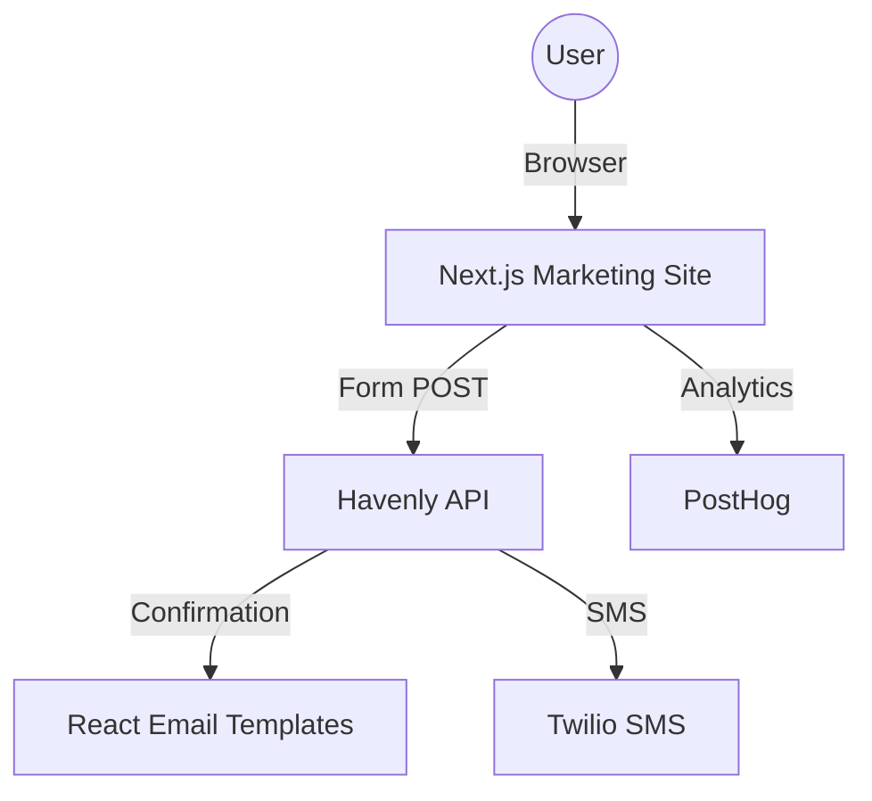

# Havenly Solutions - Marketing Website

The public face of Havenly Solutions, designed for citizen pre-registration and partner onboarding.

## Architecture

## How it works

- **Lead Acquisition**: Captures pre-registrations and partner applications via optimized forms.
- **Protocol Education**: Provides detailed information on the Stoic Guardian protocol and safety features.
- **Safety Hub**: Offers quick access to South African emergency contacts and safety guides.
- **Integration**: Seamlessly connects to the Havenly backend to trigger confirmation flows and data entry.

## Where we left off

- Integrated the standardized email layout across the registration confirmation flows.
- Updated the contact information in the footer to reflect the official brand phone number: +27 60 444 9364.
- Scrubbed the codebase of hardcoded API keys and deleted unnecessary test scripts and folders.
- Verified that all legal and protocol documentation pages are up to date.

## Errors found and fixed

- **Hardcoded Secrets**: Found and removed several plaintext API keys that were present in local environment templates and test files.
- **Incorrect Contact Info**: Corrected the brand phone number throughout the site to match the official marketing standard.
- **Redundant Scripts**: Cleaned up temporary validation scripts that are no longer needed for production.

## Engineer Profile

The Havenly Solutions marketing site is developed by an engineering team focused on creating accessible, performant, and secure civic technology platforms. The site is optimized for the South African context, including low-latency local hosting.

## Launch Roadmap

- Complete SEO optimization and sitemap generation.
- Integrate a live pre-registration counter powered by the backend API.
- Implement multi-language support for major South African languages (isiZulu, Afrikaans).
- Conduct a final cross-browser and mobile responsiveness audit before the national tour launch.
