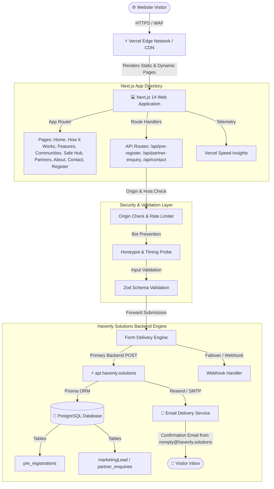

# Havenly Solutions — Website & Public Web Application

**South Africa’s First Civic Technology Software Company**  
*Your Haven. Your Community. Always On*

---

## 🚀 Application Overview

Havenly Solutions is a modern, privacy-focused civic technology platform designed to connect people, emergency response pathways, and local communities across South Africa.

This repository houses the official public web application, built with **Next.js 14**, **TypeScript**, and **Vanilla CSS**. It provides static and dynamic information pages, interactive helpline directories, pre-registration flows, partnership enquiry workflows, and secure API form delivery connected to the Havenly Solutions backend ecosystem (`api.havenly.solutions`).

---

## 🏛️ System Architecture


```mermaid
flowchart TD
    User([🌐 Website Visitor]) -->|HTTPS / WAF| VercelEdge[⚡ Vercel Edge Network / CDN]
    VercelEdge -->|Renders Static & Dynamic Pages| NextApp[💻 Next.js 14 Web Application]
    
    subgraph Frontend [Next.js App Directory]
        NextApp -->|App Router| Pages[Pages: Home, How It Works, Features, Communities, Safe Hub, Partners, About, Contact, Register]
        NextApp -->|Route Handlers| APIRoutes[API Routes: /api/pre-register, /api/partner-enquiry, /api/contact]
        NextApp -->|Telemetry| SpeedInsights[Vercel Speed Insights]
    end

    subgraph SecurityControls [Security & Validation Layer]
        APIRoutes -->|Origin & Host Check| SecurityCheck[Origin Check & Rate Limiter]
        SecurityCheck -->|Bot Prevention| HoneypotCheck[Honeypot & Timing Probe]
        HoneypotCheck -->|Input Validation| ZodValidator[Zod Schema Validation]
    end

    ZodValidator -->|Forward Submission| Forwarder[Form Delivery Engine]

    subgraph BackendEcosystem [Havenly Solutions Backend Engine]
        Forwarder -->|Primary Backend POST| BackendAPI[⚡ api.havenly.solutions]
        Forwarder -->|Failover / Webhook| Webhook[Webhook Handler]
        
        BackendAPI -->|Prisma ORM| PostgresDB[(🐘 PostgreSQL Database)]
        PostgresDB -->|Tables| PreRegTable[pre_registrations]
        PostgresDB -->|Tables| LeadTable[marketingLead / partner_enquiries]
        
        BackendAPI -->|Resend / SMTP| EmailEngine[📧 Email Delivery Service]
        EmailEngine -->|Confirmation Email from noreply@havenly.solutions| UserEmail([📩 Visitor Inbox])
    end
```

### Architecture Highlights
1. **Next.js 14 App Router**: Clean server-side rendering, static page generation, and edge-optimised performance.
2. **Security-in-Depth**:
   - CSP headers, HSTS, `X-Frame-Options: DENY`, `X-Content-Type-Options: nosniff`.
   - Honeypot fields & submission timing probes to block bot spam.
   - Strict IP rate-limiting (`6 requests per 10 minutes`).
3. **Backend Integration**: Direct integration with the single source of truth backend (`https://api.havenly.solutions`) inserting into the canonical `registrations`, `partner_enquiries`, and `contact_messages` tables.
4. **Automated Confirmation Emails**: Automated HTML confirmation emails sent from `noreply@havenly.solutions` upon successful form submission.
5. **Vercel Analytics & Performance**: `@vercel/speed-insights` integration for real-time Web Vitals monitoring.

---

## 🗺️ Navigation & Page Routes

| Path | Label | Description |
| :--- | :--- | :--- |
| `/` | **Home** | Hero section, SOS workflow overview, 6 pillars, feature showcase, pre-registration CTA. |
| `/how-it-works` | **How It Works** | 5-step emergency workflow, communication breakdown, responder connection explanations. |
| `/features` | **Features** | Comprehensive feature matrix (Safety, Communication, Community, Information, Experience). |
| `/communities` | **For Communities** | Community-level safety, neighborhood communication, and localized support features. |
| `/safe-hub` | **Safe Hub** | Interactive emergency helpline directory with instant searching & category filtering. |
| `/partners` | **Partners** | Responder & organizational partnership overview with multi-step enquiry form. |
| `/about` | **About** | Mission statement, team principles, civic technology focus, and company vision. |
| `/contact` | **Contact** | Direct inquiry form, email contact links, and SAPS emergency helpline details. |
| `/register` | **Register** | Pre-registration form with province, tier interest, and optional mobile number. |

---

## 🛠️ Local Development & Setup

### Prerequisites
- Node.js >= 18.18
- npm >= 9

### Environment Configuration
Copy `.env.example` to `.env.local`:
```bash
cp .env.example .env.local
```

Set your backend API URL in `.env.local`:
```env
NEXT_PUBLIC_SITE_URL=https://www.havenly.solutions
BACKEND_API_URL=https://api.havenly.solutions
BACKEND_API_KEY=your_optional_api_key
```

### Commands

```bash
# Install dependencies
npm install

# Start local development server
npm run dev

# Lint code and typecheck
npm run lint
npx tsc --noEmit

# Production build
npm run build
```

---

## 🚢 Deployment (Vercel)

This application is ready for Vercel deployment.

1. Connect the GitHub repository `https://github.com/Havenly-Solutions/Website.git` (branch `feature`).
2. Framework Preset: **Next.js**
3. Add Environment Variables in Vercel Dashboard:
   - `NEXT_PUBLIC_SITE_URL`: `https://www.havenly.solutions`
   - `BACKEND_API_URL`: `https://api.havenly.solutions`

---

## 📄 License & Governance

© Havenly Solutions (Pty) Ltd. All rights reserved.  
For security disclosures, see [SECURITY.md](SECURITY.md).
